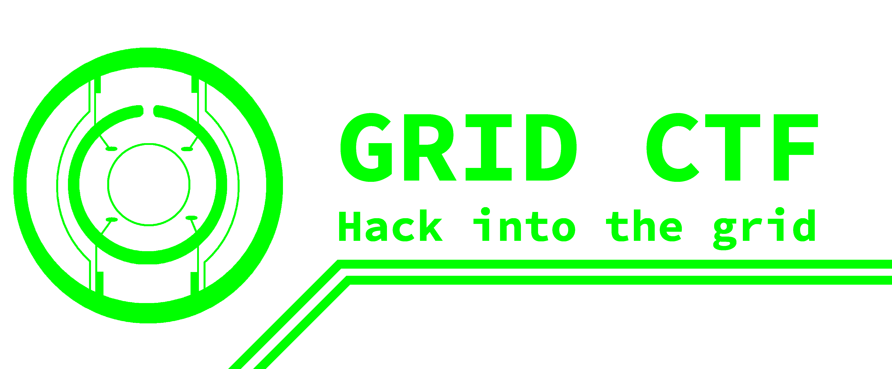

## Rules

1. **No** sharing of flags or solutions (writeups) during the competition.
2. **No** attacking the competition infrastructure (DoS, DDoS, RCE, etc).
3. **No** attacking other players (DoS, DDoS, Hacking, etc).
4. **No** brute forcing flags. (Unless you are doing it locally)
5. **Yes** to making teams to discuss and solve challenges together.

Violation of any of the rules may result in disqualification.

## Scoring

Each challenge has a set difficulty and points.
Teams that are able to solve the challenge will be awarded the points.
The team with the highest number of points will be declared the winner.

## Flag Format

Flags will be in the format `gridctf{flag}`.
